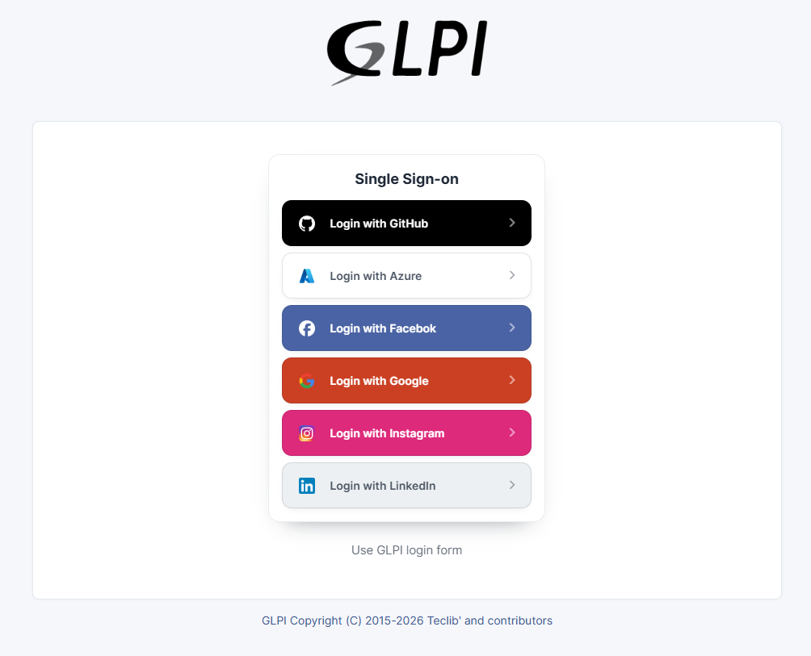
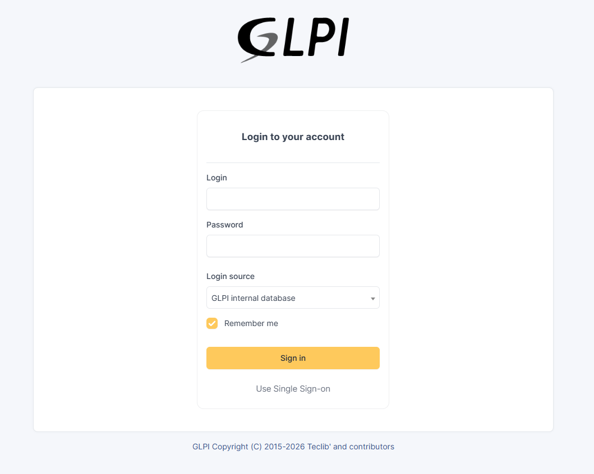

# Single Sign-On for GLPI

Single sign-on (SSO) is a property of access control of multiple related, yet independent, software systems. With this property, a user logs in with a single ID and password to gain access to any of several related systems.

# Installation
 * Uncompress the archive to the `<GLPI_ROOT>/plugins/singlesignon` directory
 * Navigate to the Configuration > Plugins page,
 * Install and activate the plugin.

# Usage
 * Go to `Configuration > Single Sign-On` and add a provider
 * To test, do logout and try login with links below login page `Login with <name>`

# Available providers
 * Azure - https://docs.microsoft.com/azure/app-service/configure-authentication-provider-aad
 * Facebook - https://developers.facebook.com/docs/apps/
 * GitHub - https://developer.github.com/apps/building-oauth-apps/creating-an-oauth-app/
 * Google - https://developers.google.com/identity/protocols/OpenIDConnect
 * Instagram - https://www.instagram.com/developer/authentication/
 * LinkedIn - https://docs.microsoft.com/en-us/linkedin/shared/authentication/authorization-code-flow?context=linkedin/context
 * Generic - Allow to define custom URLs
 * Zitadel - use _Generic_ and see parameters in [Generic Examples - Zitadel](generic_examples/zitadel.md)

# Adding translations
If your preferred language is missing. You can add your own translation with the following steps:
 * Go to the plugin folder
 * Switch to the folder locales
 * Copy one of the already existing .po files
 * Rename it into the correct notation of your language
 * Edit the file, edit msgstr to change the translation, do not touch the msgid
 * Edit the header especially the "Language: "
 * When the file is ready, then you need to compile it with: msgfmt -o filename.mo filename.po
 * If msgfmt is not found, install the package gettext (apt install -y gettext)
 * If you edit a previous translation, you may need to update the translation cache: go to Setup - General - Performance, enable Debug mode, clear translation cache

# Screenshots

# Donation
<table border="0">
 <tr>
    <td align="center">
    PayPal  
         
       
    </td>
    <td align="center">
       Pix (Brazil)  
         
       28571c52-8b9b-416c-a18f-8e5246060881
    </td>
 </tr>
</table>
