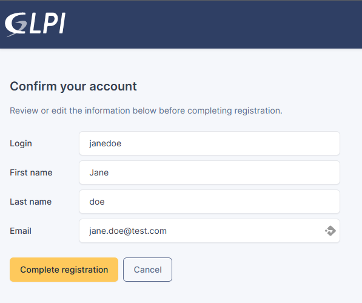
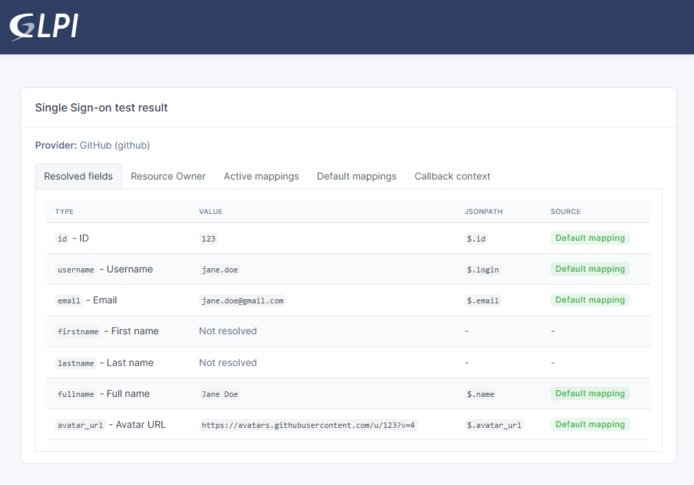

# Single Sign-On for GLPI

Single sign-on (SSO) is a property of access control of multiple related, yet independent, software systems. With this property, a user logs in with a single ID and password to gain access to any of several related systems.

# Documentation

Full administrator documentation lives in the [`docs/`](./docs/README.md) folder:

| Topic                                         | Document                                                   |
| --------------------------------------------- | ---------------------------------------------------------- |
| Overview (administrators)                     | [docs/README.md](./docs/README.md)                         |
| Installation                                  | [docs/installation.md](./docs/installation.md)             |
| Identity providers (Azure, Google, GitHub, …) | [docs/identity-providers.md](./docs/identity-providers.md) |
| Provider configuration                        | [docs/configuration.md](./docs/configuration.md)           |
| Field mappings                                | [docs/field-mappings.md](./docs/field-mappings.md)         |
| FAQ & troubleshooting                         | [docs/faq.md](./docs/faq.md)                               |
| Contributing, releases, translations          | [CONTRIBUTING.md](./CONTRIBUTING.md)                       |

# Installation

- Uncompress the archive to the `<GLPI_ROOT>/plugins/singlesignon` directory
- Navigate to the Configuration > Plugins page,
- Install and activate the plugin.

For detailed steps (GitHub clone, `composer install`, requirements), see **[docs/installation.md](./docs/installation.md)**.

# Usage

- Go to `Configuration > Single Sign-On` and add a provider. See **[docs/configuration.md](./docs/configuration.md)** for all settings. Additional notes also appear on the [wiki](https://github.com/edgardmessias/glpi-singlesignon/wiki/Plugin-Provider-Options).
- To test, do logout and try login with links below login page `Login with <name>`

# Available providers

- Azure - https://docs.microsoft.com/azure/app-service/configure-authentication-provider-aad
- Facebook - https://developers.facebook.com/docs/apps/
- GitHub - https://developer.github.com/apps/building-oauth-apps/creating-an-oauth-app/
- Google - https://developers.google.com/identity/protocols/OpenIDConnect
- Instagram - https://www.instagram.com/developer/authentication/
- LinkedIn - https://docs.microsoft.com/en-us/linkedin/shared/authentication/authorization-code-flow?context=linkedin/context
- Generic - Allow to define custom URLs
- Zitadel - use _Generic_ and see parameters in [Generic Examples - Zitadel](https://github.com/edgardmessias/glpi-singlesignon/wiki/Generic-Examples-%E2%80%90-Zitadel)

# Contributing

See **[CONTRIBUTING.md](./CONTRIBUTING.md)** for developers (repository layout, Composer, quality checks, **releases**, **translations** on Transifex, and integration hooks).

# Screenshots

  
    
  
    
  
    
  

# Donation

If this plugin helps you, please consider supporting its development:

| Platform        | Link                                                                                                                           |
| --------------- | ------------------------------------------------------------------------------------------------------------------------------ |
| GitHub Sponsors | [https://github.com/sponsors/edgardmessias](https://github.com/sponsors/edgardmessias)                                         |
| IssueHunt       | [https://issuehunt.io/r/edgardmessias](https://issuehunt.io/r/edgardmessias)                                                   |
| Ko-fi           | [https://ko-fi.com/edgardmessias](https://ko-fi.com/edgardmessias)                                                             |
| Open Collective | [https://opencollective.com/edgardmessias](https://opencollective.com/edgardmessias)                                           |
| PayPal          | [https://www.paypal.com/donate/?hosted_button_id=VM8EPZ6EW6UWS](https://www.paypal.com/donate/?hosted_button_id=VM8EPZ6EW6UWS) |
| Thanks.dev      | [https://thanks.dev/u/gh/edgardmessias](https://thanks.dev/u/gh/edgardmessias)                                                 |
