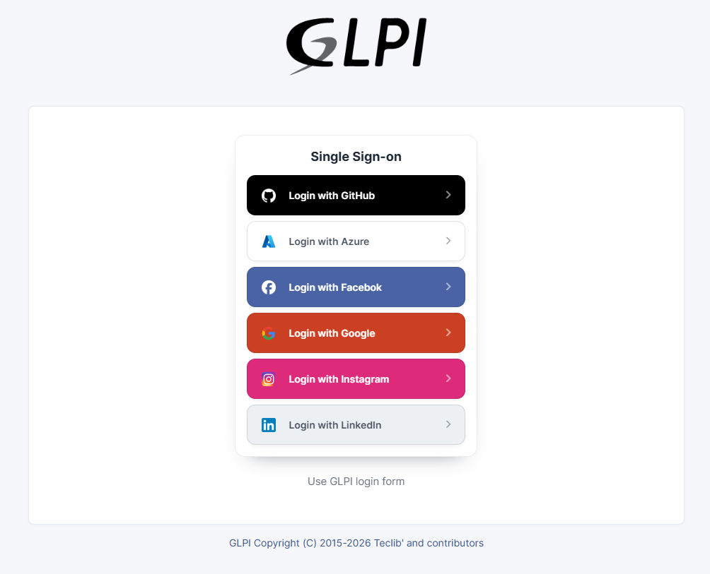
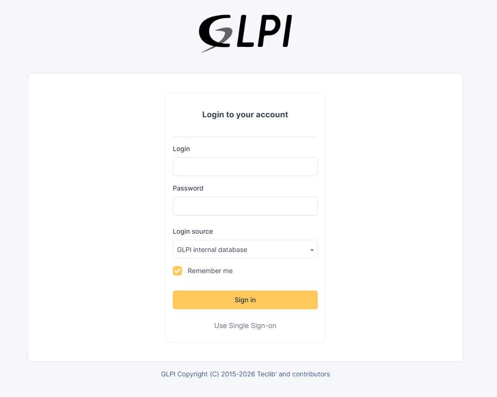

# Single Sign-On for GLPI

Single sign-on (SSO) is a property of access control of multiple related, yet independent, software systems. With this property, a user logs in with a single ID and password to gain access to any of several related systems.

# Installation
 * Uncompress the archive to the `<GLPI_ROOT>/plugins/singlesignon` directory
 * Navigate to the Configuration > Plugins page,
 * Install and activate the plugin.

# Usage
 * Go to `Configuration > Single Sign-On` and add a provider. You can find an explanation of the main configuration parameters [here](https://github.com/edgardmessias/glpi-singlesignon/wiki/Plugin-Provider-Options).
 * To test, do logout and try login with links below login page `Login with <name>`

# Dynamic field mappings (JSONPath)
This plugin supports dynamic extraction of user fields from the OAuth `getResourceOwner` payload using JSONPath expressions.

 * Configure mappings per provider in the `Field mappings` tab.
 * Supported mapping types: `id`, `username`, `email`, `avatar_url`.
 * Each mapping has: type, JSONPath expression, active flag, and order.
 * Resolution uses active mappings ordered by `sort_order` (within the same field type).
 * If no configured mapping resolves a value, the plugin uses provider defaults from `providers.json` (for provider-specific defaults) and built-in generic defaults.
 * New providers of type `generic` are automatically seeded with default mappings.

# Available providers
 * Azure - https://docs.microsoft.com/azure/app-service/configure-authentication-provider-aad
 * Facebook - https://developers.facebook.com/docs/apps/
 * GitHub - https://developer.github.com/apps/building-oauth-apps/creating-an-oauth-app/
 * Google - https://developers.google.com/identity/protocols/OpenIDConnect
 * Instagram - https://www.instagram.com/developer/authentication/
 * LinkedIn - https://docs.microsoft.com/en-us/linkedin/shared/authentication/authorization-code-flow?context=linkedin/context
 * Generic - Allow to define custom URLs
 * Zitadel - use _Generic_ and see parameters in [Generic Examples - Zitadel](https://github.com/edgardmessias/glpi-singlesignon/wiki/Generic-Examples-%E2%80%90-Zitadel)

# Adding translations
If your preferred language is missing. You can add your own [translation on Transifex service](https://app.transifex.com/eduardomozart/glpi-singlesignon/languages/).

# Adding a new release
To create a new release of this plugin automatically through GitHub Actions (Workflow), edit the file ``plugin.xml`` to include the new version tag, GLPI compatible version and download URL and create a new branch. Remember to edit the ``setup.php`` file for the new plugin version.

# Screenshots

# Donation
<table border="0">
 <tr>
    <td align="center">
    PayPal (via email)  
       
        
       edgardmessias+1@gmail.com
    </td>
    <td align="center">
       Pix (Brazil)  
         
       8e3fda51-2c8f-4134-a154-24cd02e07890
    </td>
 </tr>
</table>
